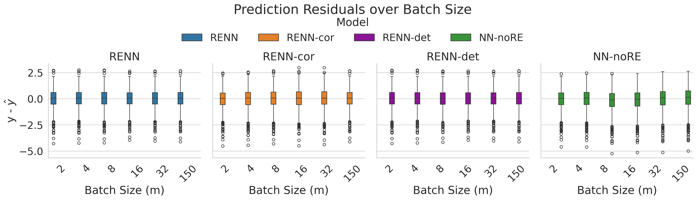

# Gene Expression Prediction from Hisopathology Images with Random Effects Neural Networks

Convolutional neural network (**CNN**) based MKI67 gene expression prediction using histopathology features from [TCGA-BRCA](https://pubmed.ncbi.nlm.nih.gov/23000897/) H&E-stained whole slide images (**WSIs**). Explicit modelling of the tissue collecting medical centers (tissue source site) as random effects groups, to account for batch effects. MKI67 gene is related to the tumor-proliferation indicating protein KI67.

This project was originally built for my master's thesis project: Analyzing batch-size effects in the training of a random-effects neural network (**RENN**) in [linear mixed models](https://en.wikipedia.org/wiki/Mixed_model) (**LMMs**) datasets, applied to histopathology **WSIs**.

## Project Overview
- This project models the relationship between tissue morphology and gene expression, while accounting for batch effects in the gene expression variable due to the tissue collecting medical center.
- Dataset: 
    - [TCGA-BRCA](https://pubmed.ncbi.nlm.nih.gov/23000897/) cohort 
    - Preprocessed tiles in h5 format from diagnostic H&E-stained WSIs
    - MKI67 gene expression (in tpm unstranded)
    - Grouping variable: Tissue collecting medical centers (tissue source site) represent random effects groups
- Model:
    - Feature extraction from WSI tiles using Inception-v3 PyTorch **CNN**-backbone with frozen weights
    - Random effects neural network (**RENN**) as regression head based on feature vectors
        - fixed effects on gene expression from feature vectors 
        - random effects from medical centers (random intercepts)
    - Predictions: Fixed effects from tissue morphology + random intercepts of the medical center
- Outputs: Several plots of training metrics and predictions for analysis of results & inference


## Pipeline

### 1. Data preprocessing
- Scripts in ```src\preprocess``` retrieve and preprocess TCGA-BRCA WSIs and genetic data from [GDC API](https://gdc.cancer.gov/developers/gdc-application-programming-interface-api)
- Preprocessing steps
    - 20x magnification extracted from .svs file
    - Otsu thresholding for tissue segmentation
    - WSIs cropped into 598x598 pixels tiles
    - Tiles retained if >80% tissue area
- **Important note**: Cohort and sample size can be manually changed in ```src\preprocess\00_get_file_ids_all.py```
### 2. Feature extraction
- ```src\histopathology_renn\00_get_features_from_tiles.py``` extracts average 2048-dim. feature vector of 32 random tiles of a WSI using a frozen Inception-v3 backbone
- Backbone defined in ```src\histopathology_renn\histo_feat_extr_backbone.py``` and **can be changed here**
### 3. Model & training
- Deep neural network with: 
    - 2048 dimensional Input layer
    - two hidden layers with 256 and 64 neurons
    - 1 dimensional regression output
- Optimization of a negative Log-Likelihood (**NLL**) loss function with **ADAM** optimizer, to train the **RENN**-head
- Investigates how different minibatch sizes affect the loss and estimated random effects variance parameter
- Additional: Several adjusted NLLs are implemented, as well as a misspecified model (no random effects modelling) as a benchmark for comparison
- ```experiments\experiment_02_histo_log_gene_inception_v3_freeze.py``` runs the training on **GPU**
- Training parameters and model setup (loss functions, minibatch sizes) are defined here and **can be manually adjusted**
- **Important note**: When changing parameters/ settings it is recommended to adjust the variable ```setting = 02_exp_log_gene_incepv3_freeze```, to control the output directory of the results (e.g. ```experiments\results\02_exp_log_gene_incepv3_freeze```)
### 4. Results analysis
- Training results are saved in ```experiments\results\02_exp_log_gene_incepv3_freeze```
- The file ```experiments\results\02_exp_log_gene_incepv3_freeze\00_e02_histo_results_to_flat_df.py``` creates a flat table as .csv
- Remaining scripts in the directory create plots for losses, variance parameter estimates and inference metrics (MSE, residuals of predictions)

## Repository Structure
``` 
RENN_for_histopathology
|   .gitignore
|   README.md
|   requirements.txt
|   LICENSE
|   Tiling_AND_Incv3_DNNRE_figure2.jpg
|   
+---data
|   |   tcga_brca_dataset_tile_meta_gene_mki67.csv
|   |   tcga_brca_file_ids.csv
|   |   tcga_brca_file_ids_metadata.csv
|   |   tcga_brca_gene_expression_tpm_unstr.csv
|   |   
|   +---incv3_frozen_features
|   |       features.npz
|   |       
|   +---metadata
|   +---temp_svs
|   +---thumbnails
|   |   +---mask
|   |   |       EXAMPLE_0a886f18-c44c-4b5e-b243-6df6e27f426a_mask.png
|   |   |       
|   |   \---wsi
|   |           EXAMPLE_0a886f18-c44c-4b5e-b243-6df6e27f426a_wsi.png
|   |           
|   \---tiles
|       
+---experiments
|   |   experiment_02_histo_log_gene_inception_v3_freeze.py
|   |   
|   \---results
|       \---02_exp_log_gene_incepv3_freeze
|           |   00_e02_histo_results_to_flat_df.py
|           |   01_e02_histo_plots_losses.py
|           |   02_e02_histo_plots_sigmas.py
|           |   03_e02_histo_plots_best_losses_over_m.py
|           |   04_e02_histo_plots_best_sigmas_over_m.py
|           |   07_e02_histo_plots_res_y_hat_MSE.py
|           |   08_e02_histo_plots_res_y_hat_GRID.py
|           |   results_flat.csv
|           |   
|           +---plots_losses_and_params
|           +---plots_residuals
|           \---results
|
\---src
    +---histopathology_renn
    |       00_check_available_data.py
    |       00_check_h5.py
    |       00_get_features_from_tiles.py
    |       histo_dataset.py
    |       histo_feat_extr_backbone.py
    |       histo_model.py
    |       histo_train.py
    |       histo_utils.py
    |       __init__.py
    |       
    \---preprocess
            00_get_file_ids_all.py
            01_wsi_download_tiling.py
            02_make_csv.py
            03_get_gene_expression.py
            04_merge_histo_data_tile_gene.py
```

## Setup & Running the Project
### 1. Requirements (conda environment "renn")
- Tech Stack
    - PyTorch, Torchvision
    - OpenCV, PIL, Openslide
    - Numpy, Pandas, h5py
    - Matplotlib (Seaborn)
```
conda create -n renn python=3.10
conda activate renn
pip install -r requirements.txt
```
### 2. Preprocessing 
```
python src\preprocess\00_get_file_ids_all.py
python src\preprocess\01_wsi_download_tiling.py
python src\preprocess\02_make_csv.py
python src\preprocess\03_get_gene_expression.py
python src\preprocess\04_merge_histo_data_tile_gene.py
```
### 3. Feature extraction
```
python src\histopathology_renn\00_get_features_from_tiles.py
```
### 4. Model training
```
python experiments\experiment_02_histo_log_gene_inception_v3_freeze.py
```
### 5. result analysis 
- Generate flat results table:
```
python experiments\results\02_exp_log_gene_incepv3_freeze\00_e02_histo_results_to_flat_df.py
```
- Losses:
```
python experiments\results\02_exp_log_gene_incepv3_freeze\01_e02_histo_plots_losses.py
python experiments\results\02_exp_log_gene_incepv3_freeze\03_e02_histo_plots_best_losses_over_m.py
```
- Parameter estimates:
```
python experiments\results\02_exp_log_gene_incepv3_freeze\02_e02_histo_plots_sigmas.py
python experiments\results\02_exp_log_gene_incepv3_freeze\04_e02_histo_plots_best_sigmas_over_m.py
```
- MSE of prediction:
```
python experiments\results\02_exp_log_gene_incepv3_freeze\07_e02_histo_plots_res_y_hat_MSE.py
```
- Residual & Prediction scatterplots & distributions:
```
python experiments\results\02_exp_log_gene_incepv3_freeze\08_e02_histo_plots_res_y_hat_GRID.py
```
## Example Results




## Notes
This repository is designed to analyze the overall behavior of a RENN (losses, parameter estimates, predictions), rather than focusing on the prediction of individual gene expression values. It can be easily extended by replacing the current Inception-v3 backbone with a pretrained state of the art model, to achieve the best possible performance for predictions. The repository will be updated continuously, to incorporate such improvements.

## Related Work

- Simchoni and Rosset (2023). “Integrating Random Effects in Deep Neural Networks”. Journal of Machine Learning Research
- Ekholm et al. (2024). “Prediction of gene expression-based breast cancer proliferation scores from histopathology whole slide images using Deep Learning”. BMC Cancer

## Citation & License
This project is licensed under the [MIT License](LICENSE).
If you use this repository or parts of it in your research or work, please cite it.